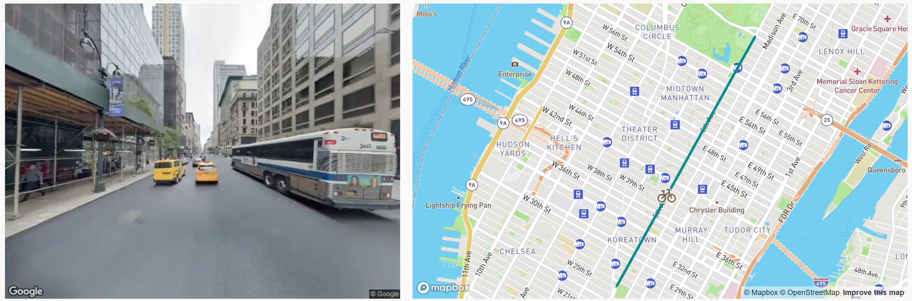

# Streetwarp Web

## Website: [streetwarp.ml](https://streetwarp.ml)

## Example:
Click to view:
[](res/demo_result.mp4)

### Description
Streetwarp Web is the web-based frontend for
[streetwarp-cli](https://github.com/pelmers/streetwarp-cli), a tool that
produces hyperlapses for GPX routes. This project is simply a web page and
associated server that invokes the command line tool. The live deployment uses
[streetwarp-lambda](https://github.com/pelmers/streetwarp-lambda) running on
[AWS Lambda](https://aws.amazon.com/lambda/) to invoke the tool with loading
the web server.

### Features
- Connect to Strava or upload GPX file directly
- Several output options to trade-off processing speed and result quality
- Animated route during video playback (using [mapbox](https://www.mapbox.com/))

### Usage
```
yarn
node_modules/.bin/ts-node src/server.ts --streetwarp-bin=<location of streetwarp binary> [--debug]
```
The following environment variables should be set:
```
AWS_ACCESS_KEY
AWS_LAMBDA_REGION
GOOGLE_API_KEY (used for metadata requests, which don't incur cost)
STRAVA_CLIENT_ID
STRAVA_REDIRECT_URI
STRAVA_CLIENT_SECRET
MAPBOX_API_KEY
```

### Future Plans
- Additional connections to other services for route import, such as Garmin, RideWithGPS, and Google Maps.
